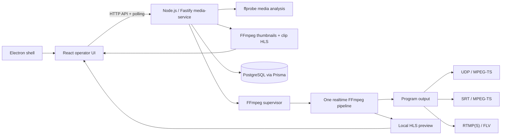
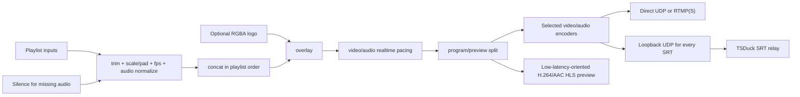
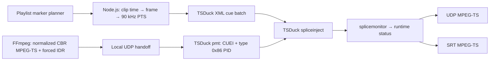
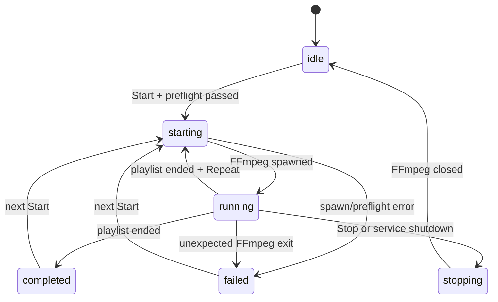

# Архитектура FluxIO

## Основной принцип

Эфирный контур отделён от интерфейса. Node.js media-service владеет PostgreSQL-состоянием и дочерним FFmpeg-процессом. React/Electron только отправляет команды и отображает состояние, поэтому закрытие окна не завершает активный поток.

## Компоненты

### Media-service

Долгоживущий Node.js/Fastify-процесс:

- проверяет FFmpeg/ffprobe и доступные encoders/protocols;
- принимает абсолютные пути только от доверенного локального Electron-клиента;
- анализирует файлы через ffprobe;
- регистрирует успешно проанализированные пути и формирует thumbnails/clip preview только для них;
- валидирует playlist, encoder, logo и endpoint через общие Zod-контракты;
- выполняет preflight;
- запускает FFmpeg без shell-интерпретации;
- разбирает `-progress pipe:1` и хранит актуальный runtime status;
- выдаёт HLS playlist/segments для preview;
- сохраняет конфигурации и историю сессий через Prisma.

Одновременно разрешена одна эфирная сессия. Повторный Start во время активной сессии возвращает conflict.

### React UI

UI не запускает FFmpeg напрямую и не имеет Node.js-доступа. Состояние playout опрашивается примерно каждые 750 ms. HLS preview воспроизводится через native HLS или `hls.js`.

### Electron

Electron предоставляет только узкий preload API:

- выбор видеофайлов;
- выбор папки медиатеки;
- выбор изображения логотипа;
- health-запрос и адрес media API.

Renderer работает с `contextIsolation: true`, `nodeIntegration: false`, `sandbox: true`. Production Electron загружает вложенную статическую web-сборку через `file://`.

### PostgreSQL и Prisma

Сохраняются:

- проанализированные media assets;
- playlist и его упорядоченные items;
- clip-relative SCTE-35 marker metadata для items;
- video/audio/logo profile;
- repeat policy;
- UDP/SRT/RTMP endpoint;
- именованная broadcast configuration;
- история broadcast sessions.

SRT passphrase и RTMP stream key исключаются из JSON-конфигурации и шифруются AES-256-GCM. Ключ берётся из `GRUBER_SECRET_KEY` и не хранится в БД.

## FFmpeg pipeline

Все playlist inputs входят в один filter graph. Это даёт последовательность ролик-за-роликом и единый timeline. Разные источники приводятся к заданным resolution, FPS, SAR, pixel format, sample rate и channel layout. Для файла без аудио создаётся тишина нужной длительности.

Логотип накладывается до `split`, поэтому одинаково виден в program output и preview.

### Program output

- UDP: MPEG-TS, `pkt_size`, TTL, optional local address;
- SRT: MPEG-TS через обязательный TSDuck relay, caller/listener/rendezvous, latency, optional passphrase и stream ID; libsrt в FFmpeg не требуется;
- RTMP/RTMPS: FLV, только H.264 + AAC.

### Preview

Preview формируется второй веткой того же FFmpeg-процесса. Это показывает программу после нормализации и overlay, но HLS добавляет несколько секунд задержки. Preview не является независимым доказательством доставки до головной станции.

Renderer приоритетно использует HLS.js даже в Electron на macOS. Это исключает ложный выбор нативной HLS-ветки Chromium. Если manifest запрошен раньше появления первого сегмента, клиент повторяет загрузку с ограниченной задержкой; recoverable media errors вызывают восстановление decoder без остановки program output.

Broadcast вычисляет оставшееся время всей программы как `totalDurationSeconds - outTimeSeconds`. Значение показывается в формате `HH:MM:SS` поверх program preview, в Playlist Progress и в Real-time Stats.

При включённом `Repeat` supervisor после штатного завершения FFmpeg увеличивает `loopCount`, сбрасывает прогресс цикла и повторно запускает заранее проверенную команду с первого ролика. Это бесконечное расписание до команды Stop. Между двумя FFmpeg-процессами возможен короткий стык, поэтому бесшовный 24/7 loop остаётся задачей rolling scheduler.

## SCTE-35

SCTE-35 реализован как отдельный data-plane stage после FFmpeg:

- Broadcast задаёт `time_signal + segmentation_descriptor` или legacy `splice_insert`, owner, PID, pre-roll, default Event ID, break duration, UPID и стратегию ID при Repeat;
- Playlist ставит `break-start`/`break-end` в позицию playhead выбранного клипа;
- для Provider используются segmentation type `0x34/0x35`, для Distributor — `0x36/0x37`;
- Event ID и остальные marker fields сохраняются как JSONB в `PlaylistItem.scte35Markers`, а глобальные defaults — в encoding profile; всё входит в snapshot playout request;
- Node.js переводит clip-relative position в общий program time, округляет его до выходного кадра и формирует PTS с частотой 90 kHz;
- FFmpeg принудительно ставит keyframe в cue-time, формирует MPEG-TS с фиксированным muxrate и отправляет его в локальный UDP socket;
- TSDuck `pmt` добавляет program registration `CUEI`, компонент `stream_type 0x86`, cue identifier и выбранный PID;
- TSDuck `spliceinject` загружает подготовленный XML, заменяет null packets SCTE-35 секциями и дважды выдаёт каждую не-immediate команду;
- `splicemonitor` возвращает наблюдаемые Event ID в runtime status;
- TSDuck отправляет итоговый MPEG-TS напрямую по UDP или SRT.

Согласно [ANSI/SCTE 35-1 2023r2](https://account.scte.org/standards/library/catalog/scte-35-1-digital-program-insertion-cueing-message-part-1-legacy-splice-based-and-time-based-signaling/), `splice_info_section` переносится в отдельном PID, на который ссылается PMT. Сам стандарт описывает signaling, а не способ рекламной врезки. [ANSI/SCTE 104 2023](https://account.scte.org/standards/library/catalog/scte-104-automation-system-to-compression-system-communications-api/) определяет отдельный путь automation → compression system, который затем формирует SCTE-35.

Рабочий injector pipeline:

FFmpeg используется как encoder/mux source, но не синтезирует cue. Секции создаются из UI metadata в XML-модели TSDuck. Для `time_signal` добавляется `splice_segmentation_descriptor`; legacy `splice_insert` также поддерживается. UPID кодируется как Ad-ID `0x03`, URI `0x0F`, UUID `0x10` или None `0x00`.

Первый marker должен находиться не раньше `pre-roll + 2 секунды` от начала программы: reserve нужен для запуска процессов, обнаружения PAT/PMT/PCR и первой выдачи cue. Нарушение останавливается на preflight, а не приводит к скрытой потере метки. Если TSDuck неожиданно завершается, supervisor fail-closed останавливает FFmpeg и помечает эфир как failed. При Repeat cue batch создаётся заново; стратегия `increment` увеличивает Event ID на номер цикла.

RTMP/FLV не переносит SCTE-35 MPEG-TS PID и при включённом injector не поддерживается. HLS preview ответвляется до TSDuck и показывает точный program picture после encoding/overlay, но не содержит downstream SCTE-35 PID.

### Preview выбранного материала

Playlist Preview не использует макетный таймер. Отдельный `MediaPreviewService` извлекает JPEG-кадры и запускает один realtime HLS-процесс FFmpeg для выбранного ролика. При Play или Seek предыдущий процесс завершается, новый стартует с заданного времени, а renderer воспроизводит manifest через HLS.js с native HLS fallback.

Клиент не может передать произвольный путь в thumbnail/preview API: разрешены только файлы, которые media-service успешно проанализировал в текущем процессе. Cache key включает канонический путь, размер, mtime и позицию кадра.

## API v1

- `GET /api/health` — процесс и статус PostgreSQL-конфигурации;
- `GET /api/capabilities` — реальные возможности FFmpeg;
- `POST /api/media/probe` — анализ переданных путей;
- `POST /api/media/scan` — рекурсивный поиск и анализ папки;
- `GET /api/media/thumbnail` — кэшированный JPEG-кадр проанализированного файла;
- `POST /api/media/clip-preview/start` — запуск HLS-preview выбранного ролика;
- `POST /api/media/clip-preview/stop` — остановка clip preview;
- `GET /api/media/clip-preview/:sessionId/:file` — manifest/segments clip preview;
- `GET /api/playout/status` — текущее состояние и метрики;
- `POST /api/playout/start` — preflight и запуск;
- `POST /api/playout/stop` — graceful stop;
- `GET /api/playout/preview/:file` — HLS playlist/segments;
- `GET/PUT/DELETE /api/configurations` — PostgreSQL-конфигурации.

## Жизненный цикл эфира

Media-service отправляет `SIGTERM` и применяет принудительное завершение только после timeout. Секреты редактируются перед попаданием командной строки или ошибок в operator logs.

## Runtime и безопасность

- production API по умолчанию слушает `127.0.0.1`;
- CORS разрешает packaged Electron origin и loopback development UI;
- FFmpeg запускается аргументами через `spawn`, без shell;
- пути media/logo проверяются на абсолютность и существование;
- systemd unit ограничивает filesystem write доступ runtime preview-каталогом;
- закрытие UI не влияет на media-service;
- service shutdown штатно останавливает активный FFmpeg и закрывает Prisma connection.

Удалённое управление не публикуется до появления authentication, authorization и TLS.

## Текущие ограничения

- один канал и один активный endpoint;
- playlist собирается в один FFmpeg filter graph, поэтому перед очень большими плейлистами нужен отдельный scheduler/rolling pipeline;
- нет резервного media-service и автоматического failover;
- нет независимого return-feed monitor головной станции;
- SCTE-35 injector реализован для SPTS по UDP/SRT; MPTS и внешнее резервирование injector остаются за границей текущего этапа;
- CPU encoders используются по умолчанию, hardware profiles ещё не включены в command builder;
- production readiness требует soak-теста на целевом железе.
