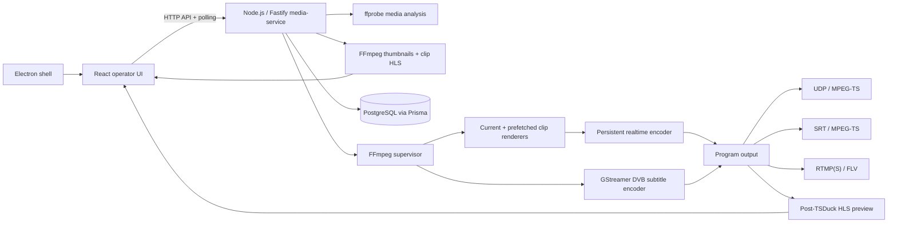
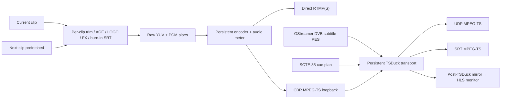
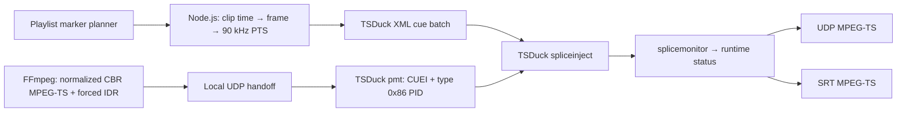
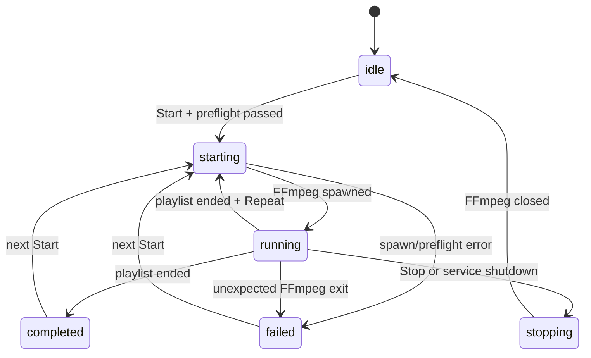

# Архитектура FluxIO

## Основной принцип

Эфирный контур отделён от интерфейса. Node.js media-service владеет PostgreSQL-состоянием и дочерним FFmpeg-процессом. React/Electron только отправляет команды и отображает состояние, поэтому закрытие окна не завершает активный поток.

## Компоненты

### Media-service

Долгоживущий Node.js/Fastify-процесс:

- проверяет FFmpeg/ffprobe и доступные encoders/protocols;
- принимает абсолютные пути только от доверенного локального Electron-клиента;
- анализирует файлы через ffprobe;
- регистрирует успешно проанализированные пути и формирует thumbnails/clip preview только для них;
- валидирует playlist, encoder, logo и endpoint через общие Zod-контракты;
- выполняет preflight;
- запускает FFmpeg без shell-интерпретации;
- разбирает `-progress pipe:1` и хранит актуальный runtime status;
- читает сетевые интерфейсы через `node:os` и отдаёт их UI для привязки UDP output;
- выдаёт HLS playlist/segments для preview;
- сохраняет конфигурации и историю сессий через Prisma.

Одновременно разрешена одна эфирная сессия. Повторный Start во время активной сессии возвращает conflict.

### React UI

UI не запускает FFmpeg напрямую и не имеет Node.js-доступа. Состояние playout опрашивается примерно каждые 750 ms. HLS preview воспроизводится через native HLS или `hls.js`.

### Electron

Electron предоставляет только узкий preload API:

- выбор видеофайлов;
- выбор папки медиатеки;
- выбор изображения логотипа;
- health-запрос и адрес media API.

Renderer работает с `contextIsolation: true`, `nodeIntegration: false`, `sandbox: true`. Production Electron загружает вложенную статическую web-сборку через `file://`.

### PostgreSQL и Prisma

Сохраняются:

- проанализированные media assets;
- playlist и его упорядоченные items;
- clip-relative SCTE-35 marker metadata для items;
- video/audio/logo profile;
- repeat policy;
- UDP/SRT/RTMP endpoint;
- именованная broadcast configuration;
- история broadcast sessions.

SRT passphrase и RTMP stream key исключаются из JSON-конфигурации и шифруются AES-256-GCM. Ключ берётся из `GRUBER_SECRET_KEY` и не хранится в БД.

## Rolling FFmpeg pipeline

Недельный Playlist не передаётся FFmpeg целиком. Supervisor запускает один
долгоживущий encoder и отдельный renderer только для текущего ролика. Следующий
renderer уже запущен и блокируется на локальном pipe; после окончания текущего
он подключается к тому же encoder без сброса video/audio PID, mux clock и
TSDuck output. Разные источники приводятся к одному resolution, FPS, SAR,
pixel format, sample rate и channel layout; для файла без audio создаётся
тишина нужной длительности.

Изменения будущих элементов Playlist отправляются через `PUT
/api/playout/playlist`. Уже идущий ролик не переписывается, а изменённый
prefetched renderer пересоздаётся. Поэтому AGE, LOGO, FX и burn-in SRT начинают
действовать на следующем старте этого ролика без перезапуска program encoder.
DVB subtitle и SCTE-35 plans создаются на старте транспортной сессии: изменение
их PID/cue plan во время эфира требует Stop/Start.

Логотип, AGE, FX и Burn-in SRT накладываются в clip-renderer до raw pipe,
поэтому одинаково попадают в program output и preview. В режиме DVB video
остаётся clean, а subtitle stream объединяется с ним только в TSDuck transport.

### DVB subtitles

Node.js объединяет cue активных `.srt` в общий program timeline с учётом trim и
длительности предыдущих роликов. GStreamer `subparse → textrender → dvbsubenc →
mpegtsmux` создаёт bitmap PES на выбранном PID. TSDuck добавляет в PMT component
`stream_type 0x06`, descriptor языка/type/page IDs и процессором `merge`
заменяет часть null stuffing subtitle-пакетами. Поэтому заданная CBR transport
rate сохраняется. Этот тракт доступен для UDP/SRT MPEG-TS; RTMP использует
Burn-in. HLS preview ответвляется до merge и намеренно не содержит отдельно
выбираемый DVB subtitle PID.

### Program output

- UDP: MPEG-TS через обязательный TSDuck PCR relay, `pkt_size`, TTL, выбранный local interface, service metadata/ID/type, elementary-stream PID, PCR interval и постоянный transport muxrate;
- SRT: MPEG-TS через обязательный TSDuck relay, caller/listener/rendezvous, latency, optional passphrase и stream ID; libsrt в FFmpeg не требуется;
- RTMP/RTMPS: FLV, только H.264 + AAC.

### Preview

Для UDP/SRT TSDuck зеркалирует уже финальный TS после merge/regulate в локальный
socket, а отдельный FFmpeg формирует из него HLS. Так preview показывает
фактическую программу после transport stage и не заставляет основной encoder
кодировать вторую HLS-ветку. Для RTMP HLS остаётся локальной веткой program
encoder. Любой локальный preview не доказывает доставку до головной станции.

Renderer приоритетно использует HLS.js даже в Electron на macOS. Это исключает ложный выбор нативной HLS-ветки Chromium. Если manifest запрошен раньше появления первого сегмента, клиент повторяет загрузку с ограниченной задержкой; recoverable media errors вызывают восстановление decoder без остановки program output.

Broadcast вычисляет оставшееся время всей программы как `totalDurationSeconds - outTimeSeconds`. Значение показывается в формате `HH:MM:SS` поверх program preview, в Playlist Progress и в Real-time Stats.

Program video получает отдельный `setfield` перед encoder. `progressive`, `upper`
(TFF) и `lower` (BFF) преобразуются в encoder-specific параметры x264, x265 или
MPEG-2 и в `field_order` FFmpeg.
GOP задаётся как точное число кадров между I-frame, число последовательных
B-frame перед P-frame и режим Closed/Open. Для детерминированной структуры
адаптивный выбор B-frame и scenecut отключены. При `B=0` H.264 сохраняет
zero-latency tune; при `B>0` reorder latency является ожидаемой частью GOP.
Closed MPEG-2 использует специальный высокий scene-change threshold, поскольку
encoder FFmpeg не допускает обычный scenecut вместе с `+cgop`.
Для UDP FFmpeg применяет `service_name`, `service_provider`,
`mpegts_service_id`, `mpegts_service_type`, `streamid` для video/audio PID и
`pcr_period`, после чего всегда передаёт MPEG-TS во внутренний loopback UDP.
TSDuck сохраняет эти параметры и перед конечным UDP output выполняет
`pcradjust` с известным CBR muxrate и явным video/PCR PID. Поскольку processor
может вставить PCR только в следующий доступный null packet, его внутренний
порог равен `max(1, PCR target − 2 ms)`. Так выбранное в UI значение является
верхней целевой границей, а не порогом, после которого допускается опоздание.
Для multicast выбранный адрес интерфейса закрепляется опцией TSDuck
`--force-local-multicast-outgoing`. При выключенном SCTE-35 этот relay не
изменяет PMT и не добавляет CUEI, cue PID или cue sections.

Program video bitrate и transport bitrate — разные уровни. `Target Bitrate`
ограничивает elementary video stream; итоговый MPEG-TS также содержит audio,
PAT/PMT/SDT, TS headers и резерв. FFmpeg получает постоянный `-muxrate` и
заполняет свободную ёмкость null packets с PID `0x1FFF`. UDP protocol pacing
использует тот же bitrate и burst не более одного datagram. Для каждого UDP/SRT
TSDuck получает явный input bitrate и процессор `regulate`, поэтому downstream
сохраняет muxrate после transport regulation и возможной замены части null
packets cue-секциями; UDP перед этим проходит PCR-коррекцию. Режим `Auto`
вычисляет запас по video peak и audio; ручной Transport bitrate проходит
preflight и не может быть ниже безопасной вместимости payload.

FFmpeg loopback send, TSDuck loopback receive и endpoint UDP send используют
увеличенные socket buffers; output объединяет семь 188-byte TS packets в
1316-byte datagram. Перед `regulate` TSDuck `continuity --fix` проверяет и
нормализует счётчики video/audio/subtitle PID; найденные входные gaps попадают в
status и logs. Это устраняет внутренний CC reset, но не восстанавливает payload,
потерянный уже на NIC/switch/receiver.

Каждый блок `-progress` добавляет в rolling Log Output количество переданных
кадров, FPS, bitrate и output time. Это телеметрия FFmpeg, а не подтверждение
приёма endpoint и не измерение конечного TS. Для UDP status отдельно содержит
применённый сервером `transportBitrateBps` и режим `manual/auto`; эти значения
одинаково передаются в FFmpeg muxrate/pacing и TSDuck fixed-bitrate `regulate`.

При включённом `Repeat` supervisor после штатного завершения цикла увеличивает
`loopCount`, сбрасывает прогресс и заново запускает rolling encoder с первого
ролика. Внутри одного цикла переходы между роликами не перезапускают encoder;
граница Repeat пока создаёт новый encoder/transport cycle.

## SCTE-35

SCTE-35 реализован как отдельный data-plane stage после FFmpeg:

- Broadcast задаёт `time_signal + segmentation_descriptor` или legacy `splice_insert`, owner, PID, pre-roll, default Event ID, break duration, UPID и стратегию ID при Repeat;
- Playlist ставит `break-start`/`break-end` в позицию playhead выбранного клипа;
- для Provider используются segmentation type `0x34/0x35`, для Distributor — `0x36/0x37`;
- Event ID и остальные marker fields сохраняются как JSONB в `PlaylistItem.scte35Markers`, а глобальные defaults — в encoding profile; всё входит в snapshot playout request;
- Node.js переводит clip-relative position в общий program time, округляет его до выходного кадра и формирует PTS с частотой 90 kHz;
- FFmpeg принудительно ставит keyframe в cue-time, формирует MPEG-TS с фиксированным muxrate и отправляет его в локальный UDP socket;
- TSDuck `pmt` добавляет program registration `CUEI`, компонент `stream_type 0x86`, cue identifier и выбранный PID;
- TSDuck `spliceinject` загружает подготовленный XML, заменяет null packets SCTE-35 секциями и дважды выдаёт каждую не-immediate команду;
- `splicemonitor` возвращает наблюдаемые Event ID в runtime status;
- TSDuck отправляет итоговый MPEG-TS напрямую по UDP или SRT.

Согласно [ANSI/SCTE 35-1 2023r2](https://account.scte.org/standards/library/catalog/scte-35-1-digital-program-insertion-cueing-message-part-1-legacy-splice-based-and-time-based-signaling/), `splice_info_section` переносится в отдельном PID, на который ссылается PMT. Сам стандарт описывает signaling, а не способ рекламной врезки. [ANSI/SCTE 104 2023](https://account.scte.org/standards/library/catalog/scte-104-automation-system-to-compression-system-communications-api/) определяет отдельный путь automation → compression system, который затем формирует SCTE-35.

Рабочий injector pipeline:

FFmpeg используется как encoder/mux source, но не синтезирует cue. Секции создаются из UI metadata в XML-модели TSDuck. Для `time_signal` добавляется `splice_segmentation_descriptor`; legacy `splice_insert` также поддерживается. UPID кодируется как Ad-ID `0x03`, URI `0x0F`, UUID `0x10` или None `0x00`.

Первый marker должен находиться не раньше `pre-roll + 2 секунды` от начала программы: reserve нужен для запуска процессов, обнаружения PAT/PMT/PCR и первой выдачи cue. Нарушение останавливается на preflight, а не приводит к скрытой потере метки. Если TSDuck неожиданно завершается, supervisor fail-closed останавливает FFmpeg и помечает эфир как failed. При Repeat cue batch создаётся заново; стратегия `increment` увеличивает Event ID на номер цикла.

RTMP/FLV не переносит SCTE-35 MPEG-TS PID и при включённом injector не поддерживается. HLS preview ответвляется до TSDuck и показывает точный program picture после encoding/overlay, но не содержит downstream SCTE-35 PID.

### Preview выбранного материала

Playlist Preview не использует макетный таймер. Отдельный
`MediaPreviewService` извлекает JPEG-кадры и запускает HLS-композицию выбранного
ролика с AGE, LOGO, FX и burn-in SRT. При Play или Seek предыдущий процесс
завершается, новый стартует с заданного времени, а renderer воспроизводит
manifest через HLS.js с native HLS fallback.

Клиент не может передать произвольный путь в thumbnail/preview API: разрешены только файлы, которые media-service успешно проанализировал в текущем процессе. Cache key включает канонический путь, размер, mtime и позицию кадра.

## API v1

- `GET /api/health` — процесс и статус PostgreSQL-конфигурации;
- `GET /api/capabilities` — реальные возможности FFmpeg;
- `GET /api/system/network-interfaces` — IPv4/IPv6 адреса сетевых адаптеров media-server;
- `POST /api/media/probe` — анализ переданных путей;
- `POST /api/media/scan` — рекурсивный поиск и анализ папки;
- `GET /api/media/thumbnail` — кэшированный JPEG-кадр проанализированного файла;
- `POST /api/media/clip-preview/start` — запуск HLS-preview выбранного ролика;
- `POST /api/media/clip-preview/composite` — preview полной композиции ролика;
- `POST /api/media/clip-preview/stop` — остановка clip preview;
- `GET /api/media/clip-preview/:sessionId/:file` — manifest/segments clip preview;
- `GET /api/playout/status` — текущее состояние и метрики;
- `POST /api/playout/start` — preflight и запуск;
- `POST /api/playout/stop` — graceful stop;
- `PUT /api/playout/playlist` — HOT CHANGE будущих элементов Current;
- `GET /api/playout/preview/:file` — HLS playlist/segments;
- `GET/PUT/DELETE /api/configurations` — PostgreSQL-конфигурации.

## Жизненный цикл эфира

Media-service отправляет `SIGTERM` и применяет принудительное завершение только после timeout. Секреты редактируются перед попаданием командной строки или ошибок в operator logs.

## Runtime и безопасность

- production API по умолчанию слушает `127.0.0.1`;
- CORS разрешает packaged Electron origin и loopback development UI;
- FFmpeg запускается аргументами через `spawn`, без shell;
- пути media/logo/SRT проверяются на абсолютность и существование;
- systemd unit ограничивает filesystem write доступ runtime preview-каталогом;
- закрытие UI не влияет на media-service;
- service shutdown штатно останавливает активный FFmpeg и закрывает Prisma connection.

Удалённое управление не публикуется до появления authentication, authorization и TLS.

## Текущие ограничения

- один канал и один активный endpoint;
- rolling pipeline держит один encoder внутри Playlist, но на границе Repeat и
  автоматического Current → Future пока создаётся новый transport cycle;
- подготовка недельного Playlist с v6.0.15 использует сохранённые результаты
  анализа media и не более восьми параллельных filesystem/ffprobe checks;
- UDP/SRT preview с v6.0.16 строится из локального post-TSDuck MPEG-TS mirror:
  processor `ip` дублирует TS после `regulate`, отдельный FFmpeg преобразует
  его в browser-compatible HLS; это внутренний program monitor, не сетевой
  return feed головной станции;
- нет резервного media-service и автоматического failover;
- нет независимого return-feed monitor головной станции;
- SCTE-35 injector реализован для SPTS по UDP/SRT; MPTS и внешнее резервирование injector остаются за границей текущего этапа;
- CPU encoders используются по умолчанию, hardware profiles ещё не включены в command builder;
- HOT CHANGE не перестраивает уже запущенные DVB subtitle/SCTE-35 планы; для
  изменения этих PID/cue plans требуется контролируемый Stop/Start;
- production readiness требует soak-теста на целевом железе.
